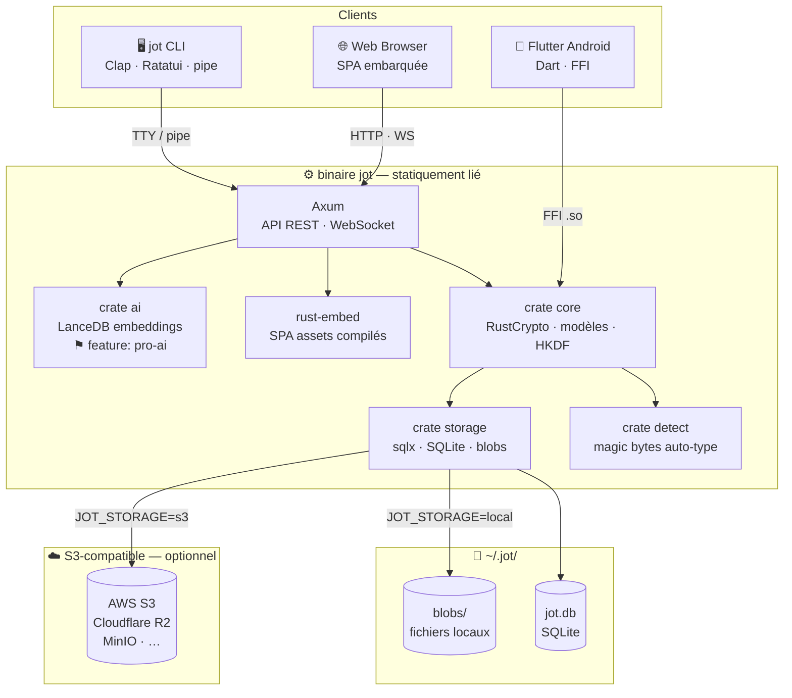

# jot

> Post-it numérique universel — chiffré, anonyme, disponible partout.

## What is jot?

jot is a universal encrypted note system — think digital post-its. It is end-to-end encrypted, anonymous by default, and designed to feel like a Unix tool: simple, composable, pipeable.

- No email, no password — identity is a local UUID
- The server never sees your note content
- One binary: CLI + API server + web SPA, statically linked
- Runs anywhere: Linux (musl), macOS, Windows

## Authentication

jot has no email or password. Identity is generated locally on first run — a UUID and a cryptographic key pair stored in `~/.jot/`.

**First device** — identity is created automatically:
```bash
jot server &        # start the server
jot init            # generates identity + registers this device
```

**Linking a new device** — run on the existing device:
```bash
jot link
# Displays a QR code + URL + 4-digit verification code
#
# Open this URL on a device already linked:
# https://localhost:8080/link/a3f9k2
#
# Verification code: 7842
#
# Waiting... ⠋
```

On the new device, open the URL (or scan the QR), confirm the code — the symmetric key is transferred encrypted via X25519 ECDH and the new device syncs automatically.

The device token (a JWT signed with Ed25519) is stored at `~/.jot/token` and sent as a Bearer token on every API request. It is managed automatically by the client.

## Connecting to a server

By default the client connects to `http://localhost:8080`. To point it at a remote or self-hosted instance, use any of the following methods (in order of precedence):

**CLI flag** — per-command override:
```bash
jot --server https://jot.example.com list
```

**Environment variable** — session-wide:
```bash
export JOT_SERVER=https://jot.example.com
jot list
jot add "my note"
```

**Config file** — persistent, stored at `~/.jot/config.toml`:
```toml
server = "https://jot.example.com"
```

The config file is created automatically on first run. The `--server` flag always takes precedence over the environment variable, which always takes precedence over the config file.

## Quick start

```bash
# Start the server (SQLite + local blob storage, zero dependencies)
jot server

# Add a note
echo "faire les courses" | jot

# Add an image (type auto-detected from magic bytes)
cat photo.jpg | jot

# Add a voice note
arecord -d 30 -f cd | oggenc - | jot

# List notes
jot list

# Pipe-friendly JSON output
jot list --format json | jq '.[] | select(.type == "voice")'
```

## Architecture



## Stack

| Component | Technology |
|---|---|
| Language | Rust (edition 2021) |
| HTTP framework | Axum |
| Database | SQLite via `sqlx` |
| Blob storage | Local filesystem (default) or S3-compatible |
| Cryptography | RustCrypto — X25519, AES-256-GCM, Ed25519, HKDF |
| CLI | Clap v4 + Ratatui TUI |
| TLS | rustls (no OpenSSL dependency) |
| Web assets | rust-embed |
| Mobile | Flutter (Android) + Rust FFI |
| Pro AI | LanceDB (`--features pro-ai`) |

## Configuration

| Variable | Default | Description |
|---|---|---|
| `DATABASE_URL` | `sqlite://~/.jot/jot.db` | SQLite file path |
| `JOT_DATA_DIR` | `~/.jot/blobs` | Blob storage directory |
| `JOT_STORAGE` | `local` | Blob backend: `local` or `s3` |
| `S3_ENDPOINT` | — | S3-compatible URL (if `JOT_STORAGE=s3`) |
| `S3_BUCKET` | — | S3 bucket name |
| `S3_ACCESS_KEY` / `S3_SECRET_KEY` | — | S3 credentials |
| `JOT_JWT_SECRET` | — | Device token signing secret |
| `JOT_PORT` | `8080` | API listen port |

## Platforms

| Target | Platform | Linking |
|---|---|---|
| `x86_64-unknown-linux-musl` | Linux x86_64 | Static (musl) |
| `aarch64-unknown-linux-musl` | Linux ARM64 | Static (musl) |
| `x86_64-apple-darwin` | macOS Intel | Dynamic |
| `aarch64-apple-darwin` | macOS Apple Silicon | Dynamic |
| `x86_64-pc-windows-msvc` | Windows x86_64 | Static |

## License

See [LICENSE](LICENSE).
