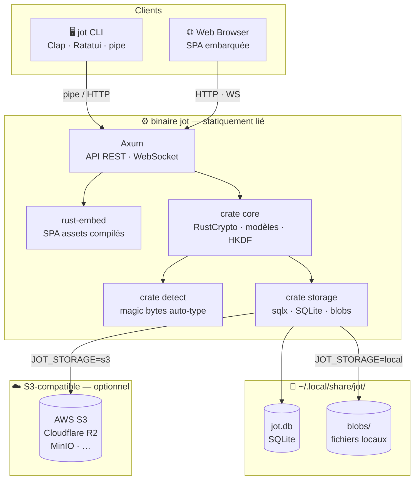
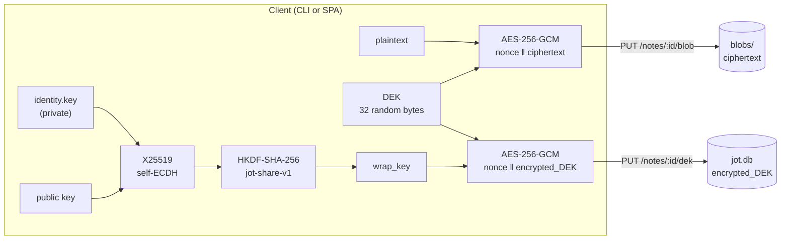
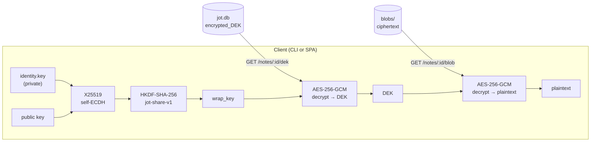

# jot

> Post-it numérique universel — chiffré, anonyme, disponible partout.

## What is jot?

jot is a universal encrypted note system — think digital post-its. Designed to
feel like a Unix tool: simple, composable, pipeable.

- No email, no password — identity is a local UUID with a friendly name
- One binary: CLI + API server + web SPA, statically linked
- Runs anywhere: Linux (musl), macOS, Windows
- Multi-user: open registration or invite-token gating
- Board and note sharing with per-identity access control

All note content is **end-to-end encrypted** — the server stores only ciphertext and
never has access to plaintext or key material.

## Quick start

```bash
# Start the server (SQLite + local blob storage, zero dependencies)
jot serve

# Open http://localhost:3000 in your browser — register a device via QR code
# or use the CLI directly after serve has created a token in ~/.config/jot/

# Add a note
echo "faire les courses" | jot add

# Add a note from your $EDITOR
jot add

# List notes (first board)
jot list

# List boards
jot list --boards

# List registered devices
jot list --devices

# Read a note
jot read <note-id>

# Launch the TUI
jot tui
```

## Authentication

jot has no email or password. Identity is generated automatically on first
`jot serve` — a UUID and a cryptographic key pair stored in `~/.config/jot/`.

**First device** — identity is created automatically when you start the server:
```bash
jot serve        # generates identity, registers this device, prints token
```

**Linking a new device** — use the web UI (Profile → "Link a new device") or:
```bash
# On the new device, open the URL shown in the browser
# The web UI displays a QR code and a jot link <token> command to run
jot link <token>
```

**Registration modes:**

```bash
# Open registration — anyone can create an account
jot serve --open-registration

# Invite-only (default) — generate a token for someone
jot invite --label "alice"
# → prints a one-time URL: http://localhost:3000/#/register?invite=<token>
```

## Connecting to a server

By default the client connects to `http://localhost:3000`. To point it at a
remote instance, edit `~/.config/jot/config.toml`:

```toml
server = "https://jot.example.com"
```

## Architecture



## End-to-end encryption

jot uses a **per-note Data Encryption Key (DEK)** model.  The private key never
leaves the device — the server only stores ciphertext and wrapped keys.

### Primitives

| Role | Algorithm | Size |
|---|---|---|
| Identity key pair | X25519 (ECDH) | 32 bytes |
| Key derivation | HKDF-SHA-256, info `"jot-share-v1"` | → 32-byte wrap key |
| Note encryption | AES-256-GCM, random 12-byte nonce | 256-bit key |
| Blob format | `[nonce 12 B]` \|\| `[ciphertext + GCM tag 16 B]` | — |

### Key lifecycle

The X25519 identity key pair is generated once on first `jot serve` and stored at
`~/.config/jot/identity.key` (chmod 600). The public key is registered in the
database. The SPA fetches the private key over the authenticated local API
(`GET /identity/me/privkey`) so both CLI and browser share the same pair.

### Write flow



### Read flow



> The server sees only `ciphertext` and `encrypted_DEK`.  It cannot recover the
> plaintext without the private key stored exclusively on the user's device.

## Web SPA

The SPA is served directly by `jot serve` on the same port as the API.
No separate web server needed.

**Features:**
- Board and note management (list view + card view)
- Real-time updates via WebSocket
- Resizable note editor panel (persisted in localStorage)
- Board and note sharing with friendly-name resolution
- Recent contacts shown as quick-pick chips when sharing
- Dark / light theme toggle
- Profile page: set/generate friendly name, link devices, manage invite tokens
- Data export to JSON (plain or AES-256-GCM encrypted with PBKDF2)

## CLI commands

| Command | Description |
|---|---|
| `jot serve [--port N] [--open-registration]` | Start the API server |
| `jot add [text…]` | Add a note (args, stdin pipe, or `$EDITOR`) |
| `jot list [--boards] [--devices]` | List notes, boards, or devices |
| `jot new board <name>` | Create a new board |
| `jot read <id>` | Read a note's content |
| `jot link <token>` | Approve a device link from the terminal |
| `jot whoami` | Show current identity and device |
| `jot invite [--label L]` | Generate an invite token |
| `jot migrate` | Apply pending DB migrations without starting the server |
| `jot tui` | Launch the interactive TUI |

## Schema versioning

jot uses `sqlx` migrations. The current schema version is displayed at startup
and available at `GET /health`:

```
Database schema: up to date (v5)
# or, after an update:
Database schema migrated: v3 → v4
```

To pre-migrate before restarting a production server:
```bash
jot migrate
```

## Stack

| Component | Technology |
|---|---|
| Language | Rust (edition 2021) |
| HTTP framework | Axum 0.7 |
| Database | SQLite via `sqlx` 0.8 |
| Blob storage | Local filesystem (default) or S3-compatible |
| Cryptography | RustCrypto — X25519, AES-256-GCM, Ed25519, HKDF |
| CLI | Clap v4 + Ratatui TUI |
| Web frontend | Preact 10 + Vite 6 + `@preact/signals` |
| Web assets | `rust-embed` (SPA compiled into binary) |

## Data export

From the Profile page in the SPA, you can export all your boards and notes as JSON.
Optionally encrypt the export with a password (AES-256-GCM + PBKDF2, 200k rounds) —
the file is saved as `.jote`.

## Platforms

| Target | Platform | Linking |
|---|---|---|
| `x86_64-unknown-linux-musl` | Linux x86_64 | Static (musl) |
| `aarch64-unknown-linux-musl` | Linux ARM64 | Static (musl) |
| `x86_64-pc-windows-gnu` | Windows x86_64 | Static |
| `x86_64-apple-darwin` | macOS Intel | Dynamic |
| `aarch64-apple-darwin` | macOS Apple Silicon | Dynamic |

## Development

```bash
# Run the server in dev mode
cargo run -p cli -- serve --open-registration

# Run tests
cargo test --workspace

# Build the SPA (required before cargo build)
cd spa && npm run build

# Apply pending migrations without starting the server
cargo run -p cli -- migrate
```

## License

See [LICENSE](LICENSE).
